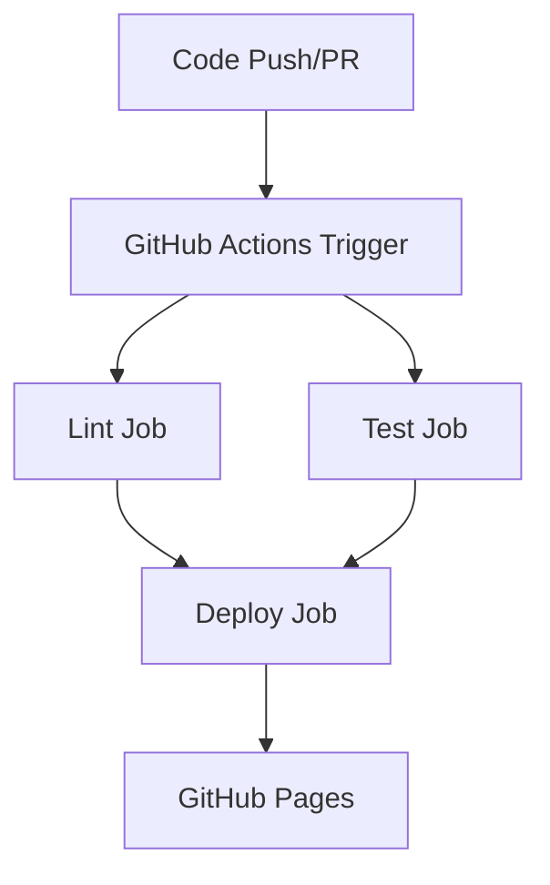

# 🗝️ Key-Value Converter

A web application for converting between different data formats (JSON, YAML, XML) built with React, TypeScript, and Vite. This project serves as a practical example for learning CI/CD pipelines and containerization in the context of modern web development.

## 📋 Prerequisites & Dependencies

### Required Software
- **Node.js** (LTS version recommended)
- **pnpm** (package manager)
- **Docker** (for containerization)
- **Git** (for version control)

### Installation Steps

1. **Install Node.js LTS**
  Visit https://nodejs.org and download LTS version or use a version manager like nvm:
   ```bash
   
   nvm install --lts
   nvm use --lts
   ```

2. **Install pnpm**
   ```bash
   npm install -g pnpm
   ```

3. **Install Docker**
   - Visit https://docker.com and install Docker Desktop
   - Ensure Docker is running before using containerization features

---

## 🚀 How to Run the Application
```bash
# Install dependencies
pnpm install
```

### Development Mode
```bash
# Start development server
pnpm dev
```

### Production Build
```bash
# Build for production
pnpm build

# Preview production build
pnpm preview
```

---

## 🐳 Docker Containerization

### What is the Dockerfile?
The `Dockerfile` creates a containerized version of the application that:
- Uses **Alpine Linux** (lightweight, secure base image)
- Installs **Node.js LTS** automatically
- Installs **pnpm** package manager
- Builds the application for production
- Runs the **preview server** on port 3000

### Docker Commands

```bash
# First build the Docker image
docker build -t key-value-converter .

# Then run the container
docker run -p 3000:3000 key-value-converter

# Finally Stop the container
docker ps  # Find container ID from terminal output
docker stop <container-id>
```
---

## 🔧 Development Scripts Explained

### Code Quality Scripts

| Script           | Command             | Purpose                              | When to Use                       |
|------------------|---------------------|--------------------------------------|-----------------------------------|
| **Format**       | `pnpm format`       | Auto-fixes code formatting           | Before committing code            |
| **Lint**         | `pnpm lint`         | Auto-fixes code style issues         | Before committing code            |
| **Format Check** | `pnpm format:check` | Checks if code is properly formatted | In CI/CD pipeline                 |
| **Lint Check**   | `pnpm lint:check`   | Checks for code style violations     | In CI/CD pipeline                 |
| **Types Check**  | `pnpm types:check`  | Validates TypeScript types           | In CI/CD & Before committing code |

### Testing Scripts

| Script   | Command     | Purpose        | When to Use                  |
|----------|-------------|----------------|------------------------------|
| **Test** | `pnpm test` | Runs all tests | During development and CI/CD |

### Running All Quality Checks
```bash
# Run all checks before committing
pnpm format:check
pnpm lint:check
pnpm types:check
pnpm test
```

---

## 🔄 CI/CD Pipeline Overview

This project uses **GitHub Actions** for Continuous Integration and Continuous Deployment (CI/CD).

### Pipeline Structure



### 1. Pull Request Workflow (`.github/workflows/pr.yaml`)

**Trigger**: Every pull request

**Jobs**:
- **Lint Job**: Runs code quality checks
  - Format checking
  - Linting
  - Type checking
- **Test Job**: Runs automated tests

### 2. Main Branch Workflow (`.github/workflows/main.yaml`)

**Trigger**: Push to `main` branch

**Jobs**:
- **Lint Job**: Same as PR workflow
- **Test Job**: Same as PR workflow  
- **Deploy Job**: Builds and deploys to GitHub Pages
  - Builds production version
  - Uploads to GitHub Pages
  - Makes application publicly available

### Pipeline Stages Explained

#### 1. **Checkout Code**
```yaml
- name: Checkout code
  uses: actions/checkout@v4
```
Downloads the repository code to the runner.

#### 2. **Setup Environment**
```yaml
- name: Setup pnpm
  uses: pnpm/action-setup@v4
  with:
    version: '10'

- name: Setup Node.js
  uses: actions/setup-node@v4
  with:
    node-version: 'lts/*'
    cache: 'pnpm'
```
Installs pnpm and Node.js LTS, caches dependencies for faster builds.

#### 3. **Install Dependencies**
```yaml
- name: Install Dependencies
  run: pnpm install --frozen-lockfile
```
Installs exact dependency versions from lockfile for reproducible builds.

#### 4. **Quality Checks**
```yaml
- name: Check Types
  run: pnpm types:check
- name: Check Format
  run: pnpm format:check
- name: Check Linting
  run: pnpm lint:check
```
Runs all code quality checks.

#### 5. **Testing**
```yaml
- name: Run Tests
  run: pnpm test
```
Executes automated tests.

#### 6. **Deployment** (Main branch only)
```yaml
- name: Build
  run: pnpm build
- name: Upload artifact
  uses: actions/upload-pages-artifact@v3
  with:
    path: './dist'
- name: Deploy to GitHub Pages
  uses: actions/deploy-pages@v4
```
Builds and deploys to GitHub Pages.

---

## 📚 Additional Resources

- [Vite Documentation](https://vitejs.dev/)
- [React Documentation](https://react.dev/)
- [TypeScript Handbook](https://www.typescriptlang.org/docs/)
- [Docker Documentation](https://docs.docker.com/)
- [GitHub Actions Documentation](https://docs.github.com/en/actions)
- [pnpm Documentation](https://pnpm.io/)